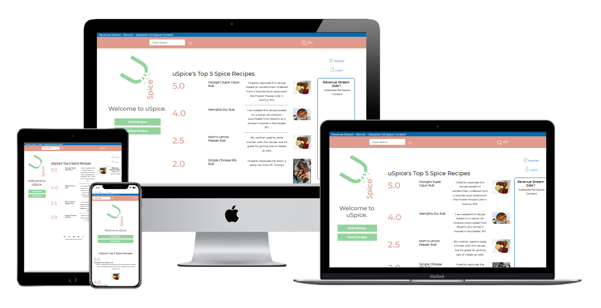

# George Lychock - MS3 Project: uSpice - Testing Documentation
### Salem State University Fullstack Software Developer Certificate
#### Backend Development Module

-   [View Live Dev Site](https://gl-uspice-dev-01.herokuapp.com/)

<h1 align="center"></h1>

## Table of Contents

-   [Usability](#TESTUSABILITY)
-   [Functionality](#TESTFUNCTIONALITY)
-   [User Stories](#TESTSTORIES)
-   [Validation](#TESTVALID)
-   [Compatibility](#TESTCOMP)

- [Bugs and Fixes](#BUGS)

# Testing
Followed test writing guidelines from the following resources:
    [Guru99](https://www.guru99.com/complete-web-application-testing-checklist.html), [softwaretestinghelp.com](https://www.softwaretestinghelp.com/web-application-testing/)
-   NOTE: Usability and Functionality test criteria were written based on development version but then verified once deployed to Heroku.
-   NOTE: All Validation results reported below are based on the deployed app via Heroku.
-   All Python functions were verified for PEP8 compliance at [pep8online.com](http://pep8online.com/)

## Usability Testing
Unless otherwise noted, all the following was tested and passed:
-   Web page content should be correct without any spelling or grammatical errors
-   Tool tip text should be present upon hovering recipe name and image links and Action buttons.
-   Enough space should be provided between field labels, columns, rows, and error messages.
-   All the buttons should be in a standard format and size.
-   Check for broken links and images.
-   Confirmation message should be displayed for any kind of update and delete operation.
-   **Not Completed Perform Peer Review
-   Scroll bar should appear only if required.
-   If there is an error message on submit, the information filled by the user should remain.
-   All fields (Textbox, dropdown, radio button, etc) and buttons should be accessible by keyboard shortcuts and the user should be able to perform all operations by using keyboard.
    -   FAIL: Tab sequence and :focus styles need to be applied across the app

## Functionality Testing
Unless otherwise noted, all the following were tested and passed:
### General
-   All images and icons render correctly
-   All buttons and active links show pointer on hover
-   Mandatory fields validate correctly, display message
-   Save and Delete functions fire a confirmation and/or message
    -   Delete button displays confirmation message to user
        FAIL: no confirmation message is present

### Navigation Bar
-   #### Home
    -   Quick Search field is present
    -   Quick Search presents a dropdown of search terms
    -   Quick Search Submit button redirects user to Search page
    -   Advanced Search link is present, redirects user to Search page

-   #### Secondary Pages
    -   Home button is present for all secondary pages, redirects user to home page
    -   Page (View) Title is present
    -   Click Path arrow buttons are present on all secondary pages
        FAIL: Click path buttons currently do not correctly redirect user to previous pages/views on all pages

### Main Header and Nav
-   #### Home and Secondary Pages
    -   uSpice Logo and Byline display correctly on the left column of all pages
    -   Build recipes button redirects a logged in user to the Build Recipe page
    -   Build recipes button redirects a visiting user to the Login Page
    -   Rated Recipes button redirects all users to the Rated Recipes page

### Main Content Block
-   #### Home
    -   Top 5 rated recipes are displayed providing information on each recipe for rating, recipe name, description, and image
    -   Recipe name and image are active links that redirect all users to the Recipe Card page for the chosen recipe
    -   Tool tip is displayed when all users hover the recipe names and recipe images

-   #### Secondary Pages - Rated Recipes
    -   Top 5 rated recipes are displayed providing information on each recipe for recipe name, description, image, date posted, rating, author, and available Actions: Submit Rating
    -   Submit Rating button redirects user to the Recipe Card for the choosen recipe
    -   Recipe name is an active link that redirects all users to the Recipe Card page for the chosen recipe
    -   Tool tip is displayed when all users hover the recipe names

-   #### Secondary Pages - Register Page
    -   Displays input fields for username, email address, password, user description, and avatar choice
    -   Hover tips are displayed for all required fields
    -   Validates and displays feedback for username field, required
    -   Validates and displays feedback for email field, required
    -   Validates and displays feedback for password field, required
    -   A description text field is presented, not required
    -   An avatar pallet is display for user to choose a custom avatar from
    -   Upon Submit, user is informed of successful registration
    -   Upon Submit, user is redirected to Profile page

-   #### Secondary Pages - Login Page
    -   Displays input fields for username and password
    -   Hover tips are displayed for all required fields
    -   Validates and displays feedback for username field, required
    -   Validates and displays feedback for password field, required
    -   Upon Submit, user is informed of successful login
    -   If user cannot be authenticated, user is informed of error, presented refreshed login page
    -   Upon Submit, user is redirected to Profile page

-   #### Secondary Pages - Profile Page - Logged In User Only
    -   Displays Name of user's profile being displayed
    -   User's description is displayed
    -   User's avatar is displayed
    -   Welcome message appears when a user logs in
    -   Displays all submitted recipes for logged in user displaying information on each recipe for recipe name, description, image, date posted, rating, and available Actions: Update Rating, Delete, Edit
    -   Update Rating button redirects user to the Recipe Card for the choosen recipe
    -   Delete button displays confirmation message to user
        FAIL: no confirmation message is present
    -   Upon Confirmation, Delete button deletes the recipe form the DB and redirects user to the user Profile page
    -   Recipe name is an active link that redirects user to the Recipe Card page for the chosen recipe
    -   Tool tip is displayed when all users hover the recipe names
    -   Non-Authenticated user do not have access to profile page

-   #### Secondary Pages - My Ratings Page - Logged In User Only
    -   Displays Name of user's ratings being displayed
    -   Displays all submitted ratings for logged in user displaying information on each recipe for recipe name, date posted, rating, and available Actions: Update Rating
    -   Update Rating button redirects user to the Recipe Card for the choosen recipe
    -   Recipe name is an active link that redirects user to the Recipe Card page for the chosen recipe
    -   Tool tip is displayed when all users hover the recipe names
    -   Non-Authenticated user do not have access to Rated Recipes page

-   #### Secondary Pages - Advanced Search Page (Search Results redirect Page)
    -   Displays term used for the search
    -   Displays all recipes matching submitted query displaying information on each recipe for recipe name, description, image, date posted, rating, author, and available Actions: Update Rating
    -   Update Rating button redirects user to the Recipe Card for the choosen recipe
    -   Recipe name is an active link that redirects user to the Recipe Card page for the chosen recipe
    -   Tool tip is displayed when all users hover the recipe names

-   #### Secondary Pages - Build Recipe
    -   Displays input fields for recipe name, description, region, flavor profile, image url, image alt text, ingredient, and preparation
    -   Hover tips are displayed for all required fields
    -   Validates and displays feedback for recipe name field, required
    -   Validates and displays feedback for image url field, required
    -   Ingredients Input:
        -   Input fields are presented for Ingredient Name (dropdown), quantity (numeric input), and measure (dropdown)
        -   A button is presented to add a configured ingredient entry to the ingredients pallet
        -   If an ingredient is not fully configured with name, quantity, and measure the user is alerted of an error
            FAIL: not validation exists for the addition of the configured ingredient
        -   Once an ingredient is configured and added to the pallet, the ingredient configuration is displayed in the pallet with a remove button
        -   When the remove button is clicked, the indredient is removed
    -   Upon Submit, user is informed of successful recipe submission
    -   Upon Submit, user is redirected to saved recipe page

-   #### Secondary Pages - Edit Recipe
    -   Displays input fields for recipe name, description, region, flavor profile, image url, image alt text, ingredient, and preparation
    -   All previously saved data is displayed in the input fields
        FAIL Although all saved data is displayed, the app shows a duplicate input field for any saved Flavor options
    -   Ingredients Input:
        -   Same as Build Recipe page
    -   Upon Submit, user is informed of successful recipe update
    -   Upon Submit, user is redirected to updated recipe page

### Features Logic
-   #### Quick Search
    -   Term choosen produces a redirect to the Search Results page displaying recipes that match the quick search term
-   #### Click Path Arrows
    -   Arrows are presented in the Nav bar section on all pages other than the Home page
    -   The left and right arrows redirect user to the previous page visited based on the current click path index; left redirects down a page, right redirects up a page, if available.

## Bugs / Fixes
### Known Bugs
#### OPEN 
-   Field Flavor does not display correctly on Edit Recipe page; duplicate check boxes appear for previously saved flavors
-   Confirmation message is not displayed for delete recipe operation. Looked at Tkinker but I had issues with a duplicate root window popping up, so I reverted to not having a delete confirmation
-   Click path buttons currently do not correctly redirect user to previous pages/views on all pages
-   If a user does not choose an avatar on Registration page, a default avatar is not applied to user profile
-   No validation exists on the ingredient input fields when adding an ingredient on the Build Recipe page

#### FIXED
-   Recipe Links on My Ratings:
    -   -   Links to recipes on My Ratings page do not work
        -   FIX: had to add "../" to the link to the link path

## Validation
NOTE: All Validation results reported below are based on the deployed app via Heroku.
The W3C Markup Validator and W3C CSS Validator Services were used to validate all html and css files in the project to ensure there were no syntax errors in the project.

-   [W3C Markup Validator (Nu)](https://validator.w3.org/nu/)
    -   index.html, NO ERRORS
    -   

-   [W3C CSS Validator (Jigsaw)](https://jigsaw.w3.org/css-validator/#validate_by_uri+with_options)
    -   style.css, NO ERRORS
    -   
-   [Lighthouse](https://developers.google.com/web/tools/lighthouse)
    -   Desktop Report - index.html
    -   
    -   Mobile Report - index.html
    -   
    -   Desktop Report - index.html - Logged In User, project and tools panels activated
    -   
    -   Mobile Report - index.html - Logged in User, project and tools panels panels activated
    -   
- [JSHint](https://jshint.com/) was used to check Javascript function logic and syntax. The following were errors captured during testing that have not been addressed:

    -   script.js functions
        -   f001 - getData
            -   
        -   f003 - whatColorScheme
            -   
        -   f004 - validateInput
            -   
    -   projects.js functions
        -   f001 - createActiveProjects
            -   
        -   f002 - createProjectLibBtns
            -   
        -   f003 - delProject
            -   
    -   widgets.js functions
        -   f001 - buildWeatherPanelMU
            -   